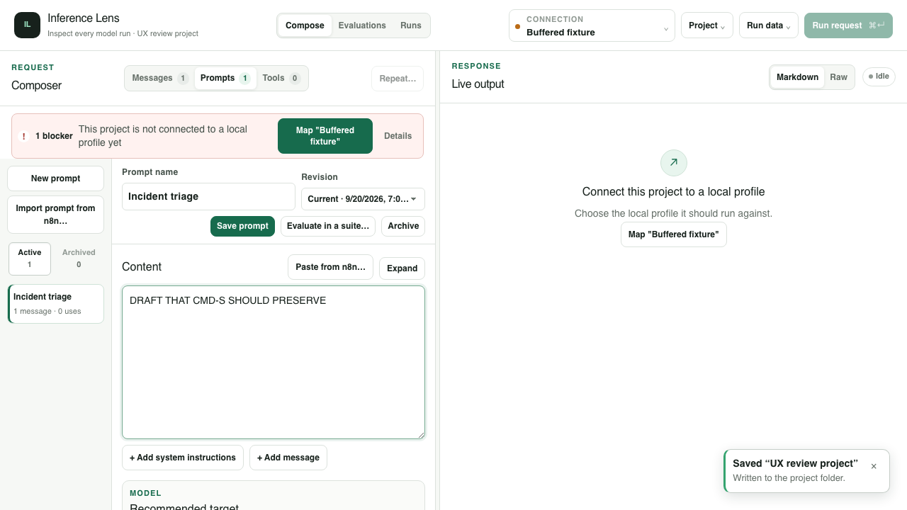
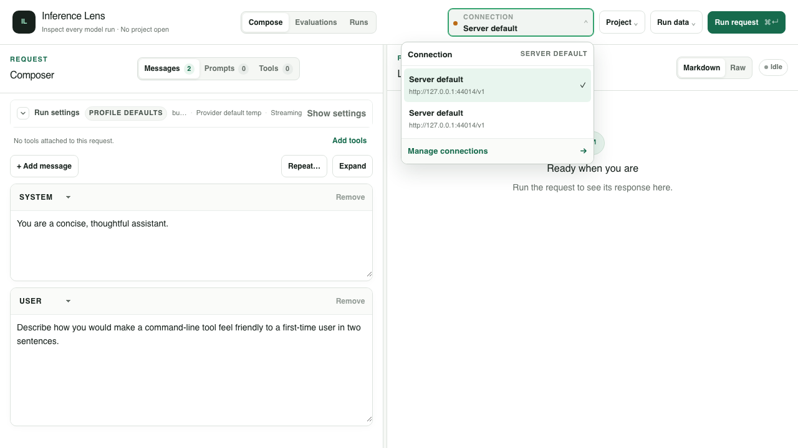

# UI/UX usability review and proposed implementation plan

**Reviewed:** September 20, 2026 · **Source baseline:** `50f48b7`
**Scope:** Whole-app usability review, with extra weight on reusing prompts and configuring tools, as requested. Assessment only; no product changes made.

## Assessment

The main problem is predictability: it is too difficult to tell **what an action will affect, which version will be used, and whether an edit has been saved**. The visual placement contributes, but several actual behavior defects make otherwise reasonable clicks feel unreliable.

The backend distinctions are useful. A portable connection requirement should not carry a credential; an immutable prompt revision should not change under an existing evaluation; a tool definition should not grant permission to execute a command. The UI currently asks the user to coordinate those distinctions across multiple controls and surfaces. It can keep those contracts while offering a much simpler task flow.

I would address these first:

1. **Protect prompt drafts and make Save truthful.** Switching tabs loses prompt edits, including after the project has reported a successful save.
2. **Use the revision the user is looking at.** Adding a displayed historical prompt revision to the conversation currently inserts the latest revision instead.
3. **Fix server-profile reconciliation and identify retained profiles clearly.** A temporary runtime-status failure can produce two identical “Server default” choices after recovery.
4. **Stop global run shortcuts from operating behind an authoring modal.** This is reproducible in the local tool library.
5. **Make prompt reuse and tool attachment direct actions in the request.** The current path repeatedly moves the user between authoring, selection, connection setup, and execution without a clear handoff.

I would not begin with a cosmetic redesign or weaken the safety rules. First repair those mismatches, then reorganize the workflows around what the user is trying to do.

## How this review was performed

This is a task-based expert review, not a measured study of multiple users. “Likely confusing” below is a design judgment; “reproduced” means exercised in the running app.

| Area | Review coverage |
| --- | --- |
| First use and project lifecycle | Fresh browser state, connection setup entry points, imported JSON and a project folder supplied through the committed directory-picker stub; source review of saving and adoption. |
| Connections and models | Profile selection versus project mapping, managed server-profile disappearance/recovery, authentication presentation, model control and ownership review. |
| Prompt reuse | Library layout, current and historical revisions, editing, tab changes, project Save shortcut, insertion, pinned previews, variable scopes, source navigation and evaluation handoff. |
| Tools | Library creation/copy, attachment, capability blockers, mock configuration, actual tool-call pause and continuation, command permission UI/source review. |
| Execution and inspection | Real loopback fixture responses, exact mock-result continuation, single-run versus Runs navigation; committed suite coverage for failure/retry, trace evidence, history, repeated runs and comparisons. |
| Evaluations | Suite setup, cases, input preview, start confirmation, real fixture execution and results; committed suite coverage for configurations, saved prompts, history and baselines. |
| Layout and input | Screenshots at 1440, 1280, 880, 390 and 320 CSS pixels for prompts/evaluations; menu dismissal, initial modal focus, keyboard shortcuts; visual inspection of dark evaluation results. |
| n8n | Entry points and source review; existing paste/conversion browser tests ran. No live n8n account was contacted. |

All generated work used disposable browser contexts, synthetic projects and loopback fixtures. The actual project that contained the user's two connections was not inspected. The duplicate-profile reproduction demonstrates a real cause, but does not establish which event caused that particular incident.

## Findings

**P1** means address before expanding the affected workflow: lost work, incorrect action semantics, an unintended run, or an ordinary path that fails. **P2** means a recurring usability obstacle. **P3** means follow-up polish or an unconfirmed concern. These are review priorities, not incident severity classifications.

### F01 · P1 · Prompt drafts can disappear after a successful project Save

**Reproduced.** Open a saved project, go to Prompts, change the content, and press Cmd/Ctrl+S. The app displays `Saved “UX review project” — Written to the project folder.` The project header does not identify the prompt edit as unsaved. Switch to Messages or Tools, then return to Prompts: the previous saved content is back.

The same loss happens on a simple tab switch without saving. The prompt editor keeps content/default drafts in component state; the conditional request tab unmounts that component. Project Save serializes the project document, which does not contain those edits. Prompt naming has a different contract again: it commits on blur, while prompt content requires **Save prompt**.

**Why it matters:** this teaches the user that neither navigation nor the word “Saved” can be trusted. It is especially costly when editing long reusable prompts.

**Recommendation:** preserve the editor draft when changing tabs, modes, selected prompts or revisions. Display an explicit draft state beside the prompt identity. Keep immutable revision creation explicit, but make the focused editor's Save shortcut save that prompt revision. If project Save excludes an open draft, its status must state that limitation. Avoid adding confirmation dialogs to routine tab changes; retaining the draft is better.

**Acceptance:** edit → change tabs/modes → return preserves exact text/defaults; Save from the editor commits the intended revision; a reload after saving restores it; unsaved prompt content cannot coexist with an unqualified “everything saved” status.

Source: [prompt editor state](../../app/project-templates-pane.client.tsx), [conditional tab rendering](../../app/request/request-composer.client.tsx), [project save](../../app/use-project-workspace.client.ts), [global Save shortcut](../../app/page.tsx).



### F02 · P1 · “Add to conversation” does not use the displayed historical revision

**Reproduced.** A prompt has two revisions with deliberately distinct text. Select Revision 1, verify the editor shows `OLD REVISION: …`, then click **Add to conversation**. The inserted card contains `LATEST REVISION: …` from Revision 2.

The insertion callback takes a template ID and position, but no selected revision ID. The insertion path consequently uses the current revision. The button also remains available while editing unsaved content; its meaning is not “use exactly what is visible.” The latter follows from the same source path; the historical-revision mismatch was directly asserted in the browser.

**Recommendation:** make the insertion contract explicit: template ID, immutable revision ID and insertion position. Label the action **Use Revision 1** when browsing history. For a dirty draft, offer **Save new revision and use** or an explicitly chosen saved revision. The pinned card should show its revision and provide **Edit source prompt**; currently its title is not a navigation link and its header does not identify the revision.

**Acceptance:** the displayed saved revision, inserted pin and resolved provider input agree. Editing a new draft never silently substitutes another revision. Existing uses stay pinned unless deliberately updated.

Evidence: [displayed historical revision](ui-ux-2026-09-20-evidence/02-displayed-historical-revision.png), [actual inserted latest revision](ui-ux-2026-09-20-evidence/03-inserted-latest-revision.png). Source: `onInsert` in [ProjectTemplatesPane](../../app/project-templates-pane.client.tsx), `insertProjectTemplate` in [template owner](../../app/templates/use-project-templates.client.ts), [core insertion](../../packages/core/src/project.ts).

### F03 · P1 · Duplicate “Server default” connections are reproducible after a transient failure

**Reproduced through the real profile hook with a stubbed runtime-status response.** Two sequences produce the duplicate:

1. Load with server configuration → reload with no configured endpoint → reload with configuration restored.
2. Load with server configuration → reload while `/api/runtime-status` returns HTTP 503 → reload after it recovers.

Both end with two different local profile identities named **Server default**, with the same endpoint. The menu shows neither record's provenance, so the name and endpoint cannot distinguish them. In this reproduction, the retained old profile stays selected and has lost its managed credential reference.

**Cause:** `reconcileServerDefaultProfile` treats an unavailable status as absence of configuration. With no endpoint it removes `credentialRef` from the existing managed profile while retaining the record. On recovery it looks for that reference, finds none, and adds a newly identified profile. Credential-mode preferences are also downgraded when configuration appears absent. Preserving identity is sound; presenting the resulting records as identical choices is not.

**Recommendation:** distinguish **status unknown/unreachable** from **confirmed configuration removed**. Do not perform configuration-removal reconciliation on a failed probe. Persist managed-profile provenance independently of whether its credential is currently available. For an intentionally retained former server profile, show **Previous server configuration** or a comparable status and its authentication state. Offer deliberate cleanup/remapping with affected project requirements visible.

Do not fix this by merging profiles with equal names or URLs. Those are not credential identities, and an automatic merge could undermine the protection the backend intentionally provides. Existing duplicates need a safe, visible resolution flow; preventing new duplicates alone is insufficient.

**Acceptance:** a failed status fetch followed by recovery preserves the profile count, identity and mappings; confirmed removal is distinguishable from unreachability; retained records never appear indistinguishable from the managed connection; no credential or mapping is reassigned merely because labels match.

Source: [reconciliation and runtime probe](../../app/use-connection-profiles.client.ts), [profile identity](../../app/profile-store.client.ts), [instance-bound mappings](../../app/project-profile-map.client.ts).



### F04 · P1 · The run shortcut operates behind the tool-library modal

**Reproduced.** Open the local tool library, create a definition, focus its function-name field, and press Cmd/Ctrl+Enter. The background Compose request runs and produces the fixture response while the modal remains open.

The global shortcut checks some execution/confirmation states, but not whether this authoring modal owns the interaction. A user editing a tool has no visible reason to expect an unrelated request to be sent.

**Recommendation:** give overlays an explicit keyboard-command scope. While a modal owns focus, background run/save/navigation commands must be suppressed or delegated to that modal's visible action. Do not rely on each new dialog remembering to add itself to a route-level list of exclusions.

**Acceptance:** Cmd/Ctrl+Enter inside every authoring/import dialog produces zero background provider requests. Opening/closing an overlay moves and restores focus consistently. The Compose shortcut still works when Compose owns the interaction.

Source: `onContextualRunShortcut` in [page](../../app/page.tsx), [tool library modal](../../app/tool-registry-modal.client.tsx).

### F05 · P1 · First-use prompt creation fails instead of presenting an authoring path

**Reproduced in a fresh session.** Before configuring an endpoint/model, Prompts offers an enabled **New prompt** button and says “Create one to begin.” Clicking it throws `ProjectValidationError` for the empty endpoint and model. The development runtime displays an error overlay; production error presentation was not checked.

The authoring action materializes a project from the current request, but that portable project requires a valid target. This is a collision between unfinished authoring and executable/portable validation.

**Recommendation:** immediately replace the unhandled failure with a usable setup state. The longer-term preference is to allow drafting prompts before provider setup, keeping incomplete drafts separate from a valid portable project until the required fields exist. Whether portable projects themselves should allow incomplete targets is a separate schema decision, not a quick UI fix.

**Acceptance:** New prompt on first use either opens a retained draft or clearly routes through necessary setup; it never throws an uncaught validation error. The user does not need an API credential merely to author text.

Source: `createProjectTemplate` in [template owner](../../app/templates/use-project-templates.client.ts), `materializeProject` in [workspace owner](../../app/use-project-workspace.client.ts). [Captured first-use state](ui-ux-2026-09-20-evidence/13-fresh-prompt-error.png).

### F06 · P2 · Prompt reuse is organized around the library rather than the request

**Observed and source-confirmed.** Messages has **Add message** and **Add tools**, but no equally direct **Insert saved prompt** or **Save messages as prompt**. Reuse means changing to Prompts, choosing a definition, finding an insertion action below the editor, and returning to Messages. An inserted prompt does not offer a direct link back to its source editor.

The library occupies the left half of Compose while the right half still says **Live output**. The global **Run request** and **Repeat…** remain available there, although they act on the underlying conversation, not the prompt currently being edited. “Recommended target” on that editor does not change the run target. A user can reasonably read the entire screen as “run this prompt” when that is not its contract.

**Recommendation:** add **Insert saved prompt…** beside **Add message**, with search, revision, insertion position and variables. Add **Save as reusable prompt…** to the message/conversation actions. Put **Edit source** and the pinned revision on each prompt use. Give library authoring a full-width surface with a clear **Use in request** handoff. Keep recommendation metadata secondary to the content and variables.

**Acceptance:** a user can insert, fill, run and return to edit a saved prompt without discovering unrelated menus; the visible run action identifies the request it will send; insertion is reachable without scrolling past optional metadata.

Source: [RequestComposer](../../app/request/request-composer.client.tsx), [ProjectTemplatesPane and TemplateUseCard](../../app/project-templates-pane.client.tsx).

### F07 · P2 · Tool creation, attachment and execution are separate decisions presented as scattered toggles

**Reproduced:** create a library definition and choose **Copy to project**. It both saves the edited library definition and copies it into the project with **Attach to requests** already checked. If the selected profile disables tools, this “copy” action immediately disables Run and produces multiple tool-capability notices.

The workflow spans several different questions:

| User's question | Current control/location |
| --- | --- |
| What tool can the model call? | Library or project definition editor. |
| Is it included in this request? | Manifest/Attach checkbox, or a one-run library snapshot. |
| May this connection send tool definitions? | Allow tool calling in Connections. |
| Who supplies the result? | Static mock, device command grant, or manual result at the pause. |
| Will it pause or continue automatically? | Interactive run versus repeated/evaluation execution policy. |

The underlying separation is appropriate. The problem is that **Copy**, **Use**, **Attach**, **Allow** and **Run** do not present these questions as one comprehensible sequence. The attached-tools manifest says which definitions are sent, but does not summarize how each will be answered. The execution controls can be far below the schema editor.

**Recommendation:** give each attached tool one compact summary: **Included in this request · Response: manual/mock/command · Approval: on call/batch start**, using the actual supported policies. Keep schema editing behind an edit action. Separate **Copy to project** from **Copy and attach**, or rename the existing action to state both effects. Likewise, do not silently save library edits as a side effect of attachment without making that visible. Provide a task-focused picker for existing tools rather than requiring the authoring modal for every reuse.

Retain explicit command grants and their exact execution details. A UI simplification must not turn defining or attaching a tool into authorization to execute it. Keep batch preflight strict when any exposed tool lacks a usable binding.

**Acceptance:** before Run, a user can identify the exact definitions being sent, what answers each call, and whether a person will be asked; copying alone has the stated attachment effect; library and project copies have understandable independence.

Evidence: [copying a tool makes the request blocked](ui-ux-2026-09-20-evidence/06-tool-copy-blocks-run.png). The audit also ran `get_weather` with a mock: it paused with `72 degrees and clear` prefilled, then **Supply results and continue** produced `Chicago report: 72 degrees and clear`. Source: [ToolsPane](../../app/tools-pane.client.tsx), [library attach/save](../../app/tool-registry-modal.client.tsx), [request draft attachment](../../app/use-request-draft.client.ts), [command permission editor](../../app/tools/command-tool-binding-editor.client.tsx).

### F08 · P2 · Selecting a connection can leave the project simultaneously “mapped” and “not connected”

**Reproduced.** Open a project mapped to Local model A, then select Local model B in the topbar. Run becomes disabled and the page says **This project is not connected to a local profile yet**. Open Connections: the mapping card says **Project connection mapped**, with A selected, while the profile editor above and below it is editing B.

This is not an absent mapping: it is disagreement between the active profile and the mapped profile. The blocker action **Map “Local model B”** only opens a mapping control; its verb sounds as if it will perform the mapping. The user must discover which dropdown changes what.

**Recommendation:** separate **edit a saved connection** from **choose what this request uses**. In a project, the target picker should show the requirement, resolved local connection and endpoint together. Offer an explicit **Use B for this project's [requirement] on this device** action with its scope visible, or **Return to mapped connection A**. Shared requirements can serve multiple evaluation configurations, so remapping must disclose those consumers rather than pretend it affects one run only.

**Acceptance:** a single intentional target change leads to a coherent ready state, or a clearly scoped remapping decision. The UI distinguishes “unmapped,” “mapped to A while B is selected,” “endpoint differs,” and “credential unavailable.”

Evidence: [contradictory mapped/connected presentation](ui-ux-2026-09-20-evidence/05-mapped-versus-active.png). Source: `chooseProfile` and readiness input in [page](../../app/page.tsx), [readiness copy](../../app/run-readiness.client.ts), [ConnectionMappings](../../app/connection-drawer.client.tsx).

### F09 · P2 · Connection/model scope is difficult to infer from the controls

**Observed/source-confirmed.** “Connection” in the topbar selects a local profile. “Connection” in an evaluation or prompt recommendation selects a portable requirement. Compose model/temperature may belong to profile defaults or project settings; evaluation settings belong to the suite/configuration. Compose delivery preference has a different persistence scope again.

The settings scope badge is a useful start, but the collapsed model summary truncates at ordinary laptop widths. The prominent topbar connection can also suggest that it drives an evaluation even though configurations resolve their own mappings. Evaluation model selection deliberately does not use the same discovery path as Compose, so similar-looking controls have different assistance.

**Recommendation:** display a contextual **Run target** summary beside the action it drives: local connection, model, delivery, and where those choices are saved. Show the full model before lower-priority temperature/delivery facts. An evaluation with multiple configurations should say **N configured targets**, not imply that the unrelated global profile is the one target. Model discovery, when offered, must resolve through that configuration's mapped profile.

The credential dot is amber for successful keyless fixtures, because it means “no credential,” not connection health. Label authentication explicitly and reserve health/error cues for actual readiness or observed failures. Keep manual model IDs supported; catalogue availability is not validity.

Source: [Topbar](../../app/topbar.client.tsx), [settings panel](../../app/inference-settings-panel.client.tsx), [model combobox](../../app/model-combobox.client.tsx), [evaluation editor](../../app/evaluations/evaluation-suite-editor.client.tsx).

### F10 · P2 · Runs is not the place where all runs can be found

**Reproduced.** Complete an ordinary Compose run and navigate to **Runs**. It says **No results open**, explains that batches/comparisons appear there, and offers **Go to Evaluations**. Ordinary history is under **Run data → Run history…**. The empty Runs screen mentions reopening saved batches from history but does not provide that action.

This is a strong explanation for wanting to click somewhere other than the implemented location. “Runs” is the most obvious destination for finding the run just completed.

**Recommendation:** make Runs the browse-and-inspect destination for ordinary runs, repeated runs and evaluations, with visible session/saved status and type filters. Keep history enumeration lazy; arriving at Runs or asking for history can be the trigger. As an interim change, add **Open run history** and **View current request result** to its empty state and explain which results it currently contains.

**Acceptance:** after a run, the user can find it from Runs without knowing the storage implementation. Unsaved session results are labeled honestly and are not mistaken for durable history.

Evidence: [Runs after a completed ordinary run](ui-ux-2026-09-20-evidence/11-empty-runs-after-success.png). Source: [RunsMode](../../app/modes/runs-mode.client.tsx), [Run data menu](../../app/topbar.client.tsx).

### F11 · P2 · Project durability is too implicit

**Observed/source-confirmed.** An imported JSON project has a project name but no folder backing it. A folder-backed project autosaves and can supply history. A named in-memory project cannot do the same. The header does not make that storage difference prominent, and Run history is disabled without an explanation when there is no workspace. **Save**, **Export**, **Save prompt**, and per-variable **Save to project** affect different layers.

Project adoption/import resets state; those source paths do not themselves ask whether a pending authoring draft needs preserving. F01 demonstrates a concrete loss path, but this review did not exhaustively reproduce every project-switch/autosave race.

**Recommendation:** add a stable project status such as **Saved to folder**, **Unsaved workspace**, **Changes pending**, or **Save failed**, with the relevant save/reconnect action. Make **Save project to folder…** distinct from **Export JSON copy…**. Connect the editor's draft status to this presentation without conflating “draft retained in memory” with “written to disk.” Review switching projects against all dirty owners.

**Acceptance:** the user can tell whether closing the tab would lose current work or run evidence, and why history is unavailable. A successful save status names what was saved.

Source: [workspace owner](../../app/use-project-workspace.client.ts), [Topbar](../../app/topbar.client.tsx), [project creation](../../app/project-creation-dialog.client.tsx).

### F12 · P2 · Prompt/tool editing wastes desktop space and becomes cramped on mobile

**Visually observed.** At 1440×900 and 1280×900, prompt authoring uses the left half while an empty response surface occupies the right. A library sidebar consumes more of that half. Optional recommended-target controls precede variables and the use action, so the most important reuse controls can be below the viewport even with one short prompt.

At 390px, the prompt list remains a side rail and leaves a content field only about 220px wide. Several navigation bands sit above it. At narrow evaluation widths, the provider-input panel can occupy up to 60vh while the editing region is reduced to a small independent scrolling area. The screen can avoid horizontal overflow and still be awkward to use.

**Recommendation:** use full-width authoring for libraries; on narrow screens, switch between list and detail instead of keeping both columns. Use **Edit / Preview** peer views for narrow evaluation screens, or a preview drawer that leaves the editor full-height. Keep the primary use/save action near the edited object and reachable without scrolling through optional metadata. Preserve draft and navigation state during layout changes.

Evidence: [desktop prompt editor](ui-ux-2026-09-20-evidence/07-prompt-editor-desktop.png), [mobile prompt editor](ui-ux-2026-09-20-evidence/08-prompt-editor-mobile.png), [mobile evaluation editor](ui-ux-2026-09-20-evidence/09-evaluation-mobile.png). Source: [request composition](../../app/request/request-composer.client.tsx), [evaluation mode layout](../../app/modes/evaluations-mode.module.css), [evaluation region layout](../../app/evaluations/evaluation-surface.module.css).

### F13 · P2 · Menus and dialogs do not share predictable keyboard behavior

**Reproduced.** Escape leaves the Project menu open. Opening Run data leaves Project open underneath it. Opening the tool library does not move focus into its modal; focus remains on **Browse local library** behind the overlay.

Source review also finds no focus trap/restoration in the tool-library modal or shared side drawer. The resize controls in the workbench implement pointer handling without equivalent keyboard resize handlers. These are targeted findings, not a completed accessibility conformance audit.

**Recommendation:** share menu/dialog behavior: one header menu open at a time, outside click and Escape dismissal, focus on opening, focus restoration on closing, modal containment where appropriate. Keep nonmodal drawers intentionally nonmodal, with an explicit focus/navigation contract. Add keyboard-operable resizing or an equivalent layout control. Apply F04's command scoping across these same owners.

**Acceptance:** all essential workflows can be completed by keyboard without landing behind a modal or retaining overlapping menus. Every disabled important action exposes a readable reason, not only a hover title.

Evidence: [overlapping menus](ui-ux-2026-09-20-evidence/10-overlapping-menus.png). Source: [Topbar](../../app/topbar.client.tsx), [shared drawer/workbench](../../app/workbench-shell.client.tsx), [tool library](../../app/tool-registry-modal.client.tsx).

### F14 · P2 · Several labels describe implementation concepts or the wrong destination

These are small changes with disproportionate value:

| Current wording/presentation | Problem | Proposed wording or behavior |
| --- | --- | --- |
| Missing model: “Choose one in Connections” | The action actually opens Messages → Run settings; Connections has no model picker. | “Choose a model in Run settings.” |
| `Map “B”` | Opens a dropdown rather than mapping B. | “Choose project connection…” or perform the explicitly scoped action. |
| Prompt **Detach** | Keeps rendered text as ordinary messages; tool Detach removes a definition from a request. | **Convert to editable messages** for a prompt; **Remove from request** for a tool. |
| Tool **Once** / “session-only” | Session lifetime and next-run consumption are different concepts. | **Next run only**, with treatment of retries/continuations explained where needed. |
| Duplicate prompt: “IDs keep the two definitions distinct” | Explains storage, not how to choose the right item. | Offer rename plus revision/content/location disambiguation in the picker. |
| “Each portable connection requirement maps explicitly…” | Makes the user learn the join before choosing a usable connection. | Lead with “Use this connection for [project target] on this device”; keep technical explanation secondary. |
| **Expand** | Visually ambiguous between expanding content and entering focus mode. | **Focus editor** where that is the action; retain accessible subject labels. |

Help documentation also trails the current UI: for example, the README routes history through Project and the evaluation authoring guide still describes an earlier Request-pane layout. Correct those during the corresponding workflow changes.

Source: [run readiness](../../app/run-readiness.client.ts), [prompt UI](../../app/project-templates-pane.client.tsx), [tool UI](../../app/tools-pane.client.tsx), [README](../../README.md), [evaluation guide](../EVALUATION_SUITE_AUTHORING.md).

### F15 · P2 · Evaluation setup needs a more task-oriented sequence

**Observed/source-confirmed.** Evaluations has useful ingredients: saved-prompt entry, named configurations, exact provider-input preview, cases/checks and saved history. However, a new author must understand the distinction between conversation revision, pinned prompt revision, prompt-variable binding, case value, base settings and configuration overrides. Several of these live in nested disclosures or independently scrolling regions.

**Recommendation:** organize setup as **Prompt/input → Case inputs → Configurations and tools → Review run**. Keep an always-readable input/revision summary and the existing exact provider-input preview. When starting from a saved prompt, make variable-to-case mapping an explicit offered step, rather than requiring the user to infer why editing cases does not vary the prompt. Distinguish **suite defaults** from **configuration overrides** beside the relevant controls. Preserve advanced historical revision selection as a secondary path.

The results layout already separates completion from check outcomes well; preserve that. Improve **Open Response & Inspect** to a more direct **Open run** entry, with a breadcrumb back to suite/configuration/case/repetition. Do not put editable current settings into an “As run” record.

**Acceptance:** an author can create two different case inputs, preview their distinct provider messages, run both and return to the exact failing case without confusing current edits with historical evidence.

Source: [evaluation editor](../../app/evaluations/evaluation-suite-editor.client.tsx), [results workspace](../../app/evaluations/evaluation-results-workspace.client.tsx). [Dark results reviewed](ui-ux-2026-09-20-evidence/12-evaluation-results-dark.png).

**P3 follow-up:** the baseline and audit both logged React duplicate-key warnings in the evaluation setup. `ConfigurationsSection` and `ToolsSection` are siblings keyed by the same suite ID. Investigate and correct that separately; this review did not attribute a visible failure to it. Also review long prompt/model names, realistic library sizes and error density beyond the small synthetic datasets used here.

## Where actions should be discoverable

This is the proposed first-click map, directly addressing the feeling that controls are elsewhere than expected.

| Intent | First place to offer it | What should happen |
| --- | --- | --- |
| Reuse a prompt | Beside Add message | Search/pick a saved revision, fill variables and insert at an explicit position. |
| Save the current useful prompt | Message/conversation actions | Create a reusable prompt from the selected messages without retyping them. |
| Edit an inserted prompt's source | Its title / Edit source action | Open the correct library item and pinned revision, preserving the request. |
| Change the actual provider/model | Run target summary beside the request/configuration | Show effective target and the scope of the proposed change together. |
| Add a tool to a request | Attached-tools summary | Pick or create a definition, choose attachment scope, see response handling. |
| Configure a tool's execution | That attached tool's summary | Select manual/mock/declared-command behavior and retain required consent. |
| Find a previous result | Runs | Browse session and project history, then inspect a selected run. |
| Save work | Status/action beside the edited object | Commit the relevant draft and show whether it is on disk. |

## Design decisions to agree before implementation

These are recommendations, not adopted contracts. The repository's design-first requirement applies before implementing the consequential choices below.

| Decision | Options and tradeoff | Recommendation |
| --- | --- | --- |
| Library navigation | Keep libraries inside Compose and add contextual pickers: smaller change, but authoring and running still share one surface. Add a dedicated full-width Library destination: clearer intent, one more mode. | Add contextual pickers immediately; prototype a Library destination with Prompts/Tools for sustained authoring. Validate its first-click behavior before committing the navigation change. |
| Prompt draft persistence | Component-local drafts are simple but fragile. Session drafts owned above navigation preserve work without writing new local data. Automatic browser recovery adds durability and a privacy/storage policy. | Start with explicit session draft ownership and Save revision. Decide separately whether to persist unsaved prompt content for crash recovery. |
| Incomplete authoring | Require a valid target before project-backed editing, or introduce a draft layer, or relax the portable project schema. | Use an authoring draft layer; keep executable/portable validation strict unless a separate schema proposal justifies changing it. A guided setup state is an interim fix. |
| Connection selection in projects | Select only an active local profile, remap an existing requirement, or add a run-only override. These have different effects on evaluations and portability. | Offer an explicit remap of the named requirement on this device and disclose its consumers. Do not introduce an implicit run-only override or rewrite the portable endpoint. |
| Existing duplicate server profiles | Hide/merge equal labels, or preserve identities and guide the user through choosing/remapping/retiring the old record. | Preserve identities; distinguish managed/previous/local provenance and provide deliberate cleanup. Treat probe failures as unknown status. |
| Tool copy/attachment | Copy automatically attaches, or copying and attaching are separate named actions. | Separate the choices or use “Copy and attach.” Existing command permission grants remain distinct from both. |
| Runs ownership | Keep a selected-batch viewer plus a separate history drawer, or make Runs own history and selection. | Make Runs the history/inspection destination while keeping artifact reads lazy and storage status explicit. |

### Proposed owners and compatibility boundaries

| Feature owner | Contract to establish | Persistence/compatibility consequences |
| --- | --- | --- |
| Prompt authoring owner, outside the conditionally mounted pane | Draft keyed by project, template and source revision; dirty state; save/discard; exact revision to use/evaluate. | Preserve immutable revisions and pinned uses. In-memory draft retention needs no project schema change. Browser recovery would need an explicit local storage policy. |
| Contextual target owner/presenter | Named requirement, resolved profile instance, endpoint, effective model, readiness, scope and explicit remap command. | Keep credentials and mappings device-local. Do not replace `(profileId, instanceId)` with name/URL matching. Portable endpoint changes remain explicit. |
| Connection-profile owner | Managed provenance, last verified server configuration and current availability are separate facts. | A local metadata migration may be needed. Do not recycle identities or transfer credentials during repair. Runtime wire/project formats need not change just to improve labels. |
| Tool-attachment owner | Definition source, attachment lifetime, provider capability and effective response handler summarized together. | Preserve snapshot semantics and separate grants. Decide any new source/update metadata before changing the project format. |
| Overlay/command owner | Focus, dismissal and allowed keyboard commands for the topmost interaction surface. | UI/session behavior only; keep route composition limited to adapters. |
| Runs/history owner | List/filter/selection, session-versus-saved status and return navigation. | Continue validating immutable artifacts on demand. No need to alter trace evidence to reorganize its presentation. |

Keep provider-neutral intent in these contracts. Endpoint/authentication details and OpenAI-compatible request serialization should stay with the existing provider/transport layers. A usability pass is not a reason to invent a new provider abstraction or expand `page.tsx` with every feature's draft state.

## Proposed delivery order

Relative sizes describe scope, not calendar estimates: **S** is a focused behavior/presentation change; **M** spans a feature owner and its consumers; **L** changes navigation or workflow ownership.

| Stage | Work | Size | Exit criteria |
| --- | --- | --- | --- |
| 1 · Restore trust | F01 draft retention/save truth; F02 exact revision insertion; F03 failed-probe reconciliation and visible duplicate identity; F04 modal command scope; F05 handled first-use path. Correct misleading destination copy from F14. | M, split into focused PRs | Regression tests fail on the actual current incorrect values/requests before fixes, then pass. No silent draft loss or revision substitution; no background run behind a modal; no new duplicate after status recovery. |
| 2 · Prompt reuse | Decide draft/save semantics and authoring surface. Add contextual insert, Save as prompt, revision labels and Edit source. Move optional recommendation metadata below core content/variables. | M–L | Complete draft → save → insert → fill → run → revise → deliberately update a use with no ambiguous handoff. |
| 3 · Tool workflow | Task-focused attachment picker; truthful copy actions; per-tool response/approval summary; simplify schema/detail presentation. | M | Before running, inclusion and execution policy can be read without visiting three surfaces. Interactive approval and batch preflight remain intact. |
| 4 · Target selection | Implement agreed project remap interaction; separate connection management from run targeting; clarify model/authentication scope. Handle existing duplicate records. | M | Switching providers has a named scope and a coherent effective target. Old project mappings and credential boundaries remain valid or require explicit repair. |
| 5 · Navigation and layout | Runs history/selection, durable-workspace status, narrow-screen editor/preview behavior, menu/dialog consistency and targeted evaluation simplification. | L, split by owner | Primary tasks remain reachable at desktop and phone widths; history is discoverable from Runs; keyboard interaction does not leave the active surface. |

Menu/focus fixes should accompany every touched surface rather than wait until the end. Stages 2–5 depend on the design decisions above; Stage 1 can be broken down and agreed without committing to a wholesale navigation redesign.

## Verification plan for the implementation

Write regression tests **before** changing behavior. Assert on the incorrect content, identity, persistence result or network action, not just on whether a panel opened. The audit harness attached here deliberately characterizes today's problems; it must not become a permanent suite that blesses those problems as desired behavior.

| Regression/task | Required observable result |
| --- | --- |
| Prompt draft survival | Exact edited messages/defaults survive request tabs, mode changes and prompt/revision selection. Saving produces the intended immutable revision and persisted document. |
| Historical use | Selecting Revision 1 and using it yields Revision 1 in the pin, resolved preview and serialized provider request. |
| Server-profile recovery | Healthy → HTTP failure → healthy preserves count/identity/mapping. Confirmed removal/reintroduction has a distinct, deliberate outcome. Seed existing duplicates to test repair too. |
| Modal command scope | A provider-request counter stays at zero for global Run inside each modal. Focus enters the modal and returns to its opener. |
| Fresh authoring | An unconfigured session can follow the advertised New prompt path without an uncaught error or loss of typed content. |
| Tool copy/attach | Copy and attachment effects match the button; enabling the provider capability and authorizing execution stay separate. Verify actual serialized tools and exact returned results. |
| Project remapping | Old/new effective targets and affected requirement consumers are visible. A stale profile instance never gains a credential through label matching. |
| Prompt/tool usability | Start from a populated library, insert the intended revision/tool, configure it and run without searching unrelated settings. |
| History and saved state | Find a just-completed ordinary run and a saved evaluation from Runs; distinguish in-memory results from durable artifacts. |
| Layout and keyboard | Exercise 320/390, relevant breakpoint boundaries and desktop in both themes; verify reachable controls and usable editing height, not only zero page overflow. |

Run the affected committed Playwright spec during each change, then the full suite once before handoff, following [AGENTS.md](../../AGENTS.md) and [the browser guide](../../tests/e2e/README.md). Use fixture outputs that prove real provider input/continuation, following [the fixture guide](../PROVIDER_FIXTURES.md).

After implementing the main workflow changes, a short observed session with the user should cover: reuse an old prompt revision; edit and save it; attach a mock-served tool; change the project's provider; find the previous result. Record first click, wrong turns, whether the user can predict what will run/save, and whether they need explanation. Those measurements have not been collected in this review.

## Checks actually run and limits

- **Committed full browser suite:** `npm run test:e2e` — **158 passed**, 46.9 seconds. This includes its configured light/dark projects; only the repository's theme-sensitive specs run in both themes. It is not full dark-mode coverage of every workflow.
- **Initial audit harness:** 8 characterization scenarios passed. Additional scenarios then covered temporary HTTP failure, project Save, copying a library tool and the modal Run shortcut.
- **Expanded audit:** 11 passed; one assertion failed because it expected lowercase `saved` while the actual toast starts with `Saved`. After correcting the harness assertion, that scenario passed, including the subsequent assertion that the unsaved prompt content was lost. **Twelve distinct audit scenarios were confirmed overall.** The casing failure is not evidence of a product defect or a meaningful red regression run.
- Screenshots were captured after disabling finite animations for the retained evidence; a mid-transition drawer capture was replaced. The screenshots are synthetic review data, not the user's private project.
- No fixes were implemented, so no fix-before/after red/green regression claim is made. Build, unit and Rust suites were not run for this documentation-only deliverable.
- Native folder pickers were stubbed through the committed helper. Real filesystem permission/reconnect behavior, Tauri/macOS Keychain, real provider credentials, live n8n API import, screen-reader output and cross-browser behavior were not verified. Existing fixture tests cover portions of these workflows, not those real integrations.
- The duplicate incident's exact history remains unknown. Small synthetic libraries/case sets also do not establish usability with hundreds of prompts/tools or long-running production evaluations.

The most valuable follow-up for the user's own eyes is the proposed placement of **Insert saved prompt**, **Edit source**, tool response handling and the contextual target selector. Those choices should be reviewed in an interactive prototype before the larger navigation changes are implemented.

### Reproducing the audit

The retained [audit harness](ui-ux-2026-09-20-evidence/audit.spec.ts) uses the repository's existing Playwright setup and shared drivers. It is stored with the review rather than installed as a regression spec because several assertions deliberately prove undesirable current behavior.

From the repository root, copy it to `tests/e2e/ui-ux-audit.spec.ts` and run:

```sh
npm run test:e2e -- tests/e2e/ui-ux-audit.spec.ts --workers=2
```

Remove that temporary test copy afterward. Captures are written to `/tmp/inference-lens-ux-evidence`; selected evidence is retained beside this report. Re-running on a fixed version should invalidate the relevant characterization assertions; replace them with desired-behavior regressions rather than preserving the old expectation.
